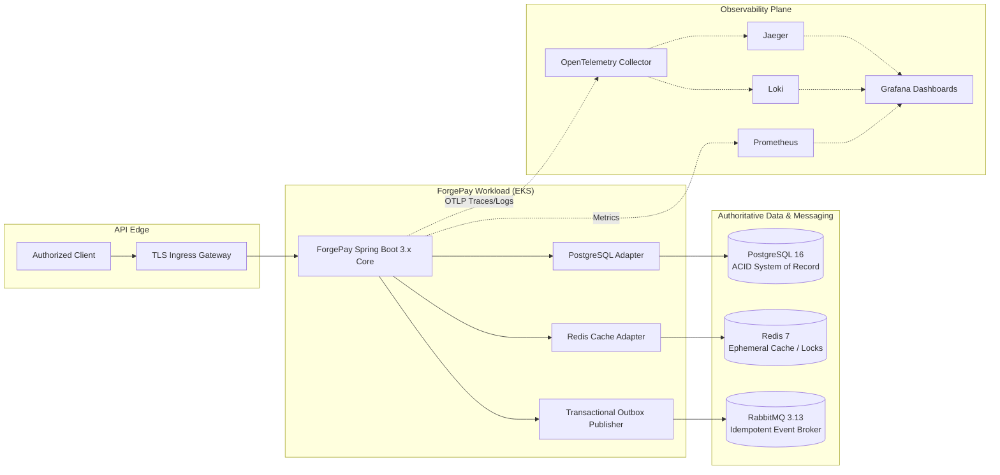
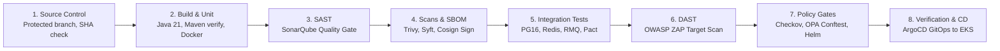
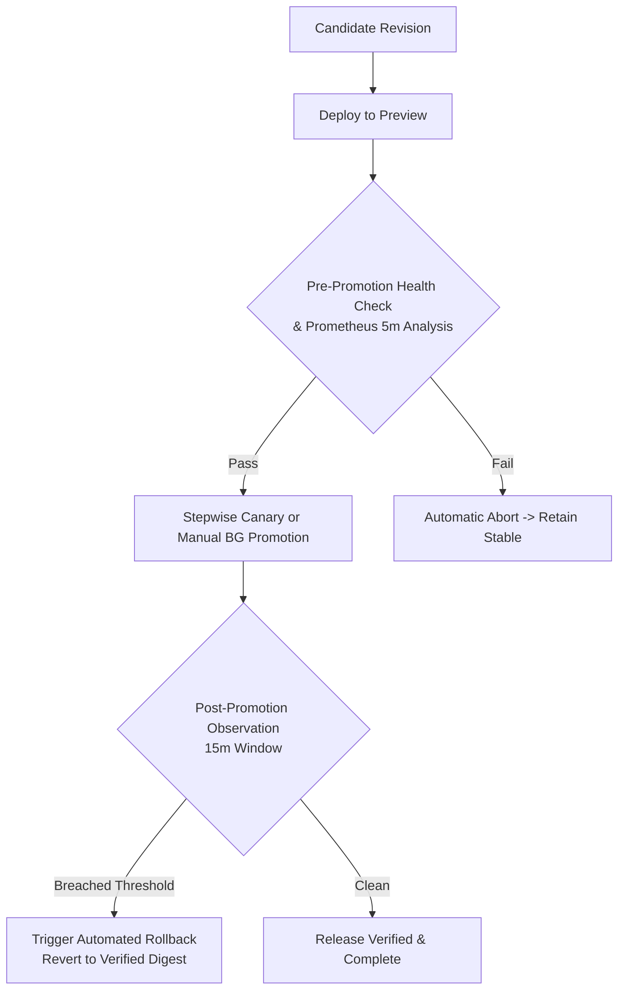
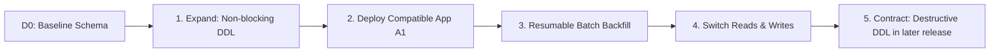
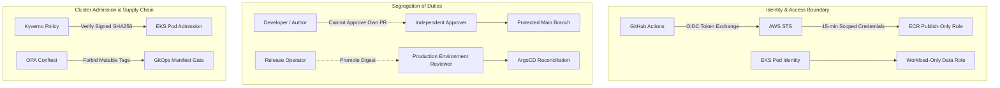

# ForgePay – Zero-Downtime CI/CD & Compliance Platform

> **FORGEPAY - BY FIIFII**

## AI Attribution Block

This repository and its documentation were developed with AI assistance across multiple engineering specialist roles. All architectural designs, CI/CD pipelines, Kubernetes manifests, OPA/Kyverno policies, observability configurations, database migration frameworks, and incident runbooks represent target specifications and static validation artifacts. No live AWS infrastructure, EKS clusters, production database instances, or runtime telemetry are claimed to exist. Human review, explicit environment provisioning, and regulatory audit approval are required prior to live production operations.

---

## Executive Summary

**ForgePay** is an enterprise-grade digital banking platform designed to deliver mission-critical payment services with five-nines availability (99.999%), sub-two-hour commit-to-production velocity, and rigorous regulatory compliance under the **Reserve Bank of India (RBI) Master Direction on IT Framework** and **PCI-DSS v4.0**.

The platform is architected as a modular Java 21 / Spring Boot 3.x core deployed to **Amazon EKS** via **ArgoCD GitOps** and **Argo Rollouts**. Deliveries are executed using a build-once, signed-digest paradigm where every container image is validated through eight canonical CI/CD stages, signed using keyless **Cosign**, attested with **Syft SBOMs**, and admitted through immutable digest pinning. Zero-downtime database evolution is guaranteed via an **expand-contract lifecycle** on **PostgreSQL 16**, fully decoupled from application rollbacks.

---

## System Architecture

ForgePay employs a hexagonal (ports-and-adapters) architecture that encapsulates banking business logic away from infrastructure concerns.



### Core Architecture Boundaries
* **Authoritative Store:** PostgreSQL 16 maintains absolute financial invariants and ledger truth.
* **Transactional Outbox:** Guaranteed at-least-once message dispatch to RabbitMQ 3.13 without distributed 2PC transactions.
* **Non-Authoritative Caching:** Redis 7 provides read acceleration and idempotency key tracking; cache eviction never impacts ledger consistency.
* **Explicit Module Isolation:** Domain services (Accounts, Payments, Ledger, Notifications) communicate via inward-facing interfaces and immutable domain events.

Detailed specifications: [`docs/01-pipeline-architecture/`](docs/01-pipeline-architecture/README.md) and [Architecture Decision Records (ADRs)](docs/01-pipeline-architecture/adr/).

---

## The 8 Canonical CI/CD Stages

ForgePay strictly implements eight discrete, non-bypassable delivery stages across GitHub Actions and ArgoCD:



1. **Source Control:** Non-merge commit verification on protected `main` branch with mandatory peer review.
2. **Build:** Java 21 Temurin compilation, Maven unit testing, container compilation, image digest calculation, and immutable release metadata generation ([`.github/workflows/ci.yml`](.github/workflows/ci.yml)).
3. **SAST:** Static code analysis via SonarQube/SonarCloud enforcing security quality gates ([`sonar-project.properties`](sonar-project.properties)).
4. **Dependency/Container Scanning & Signing:** Trivy filesystem vulnerability analysis, Syft SPDX SBOM generation (`sbom.spdx.json`), Trivy container scanning, keyless Cosign image signing via GitHub Actions OIDC, and GitHub build provenance attestation.
5. **Integration & Contract Testing:** Ephemeral service containers (PostgreSQL 16, Redis 7, RabbitMQ 3.13) verifying database schemas and consumer-driven contract tests via Pact.
6. **DAST:** Dynamic application security testing via OWASP ZAP baseline scan against pre-authorized, controlled endpoints.
7. **Policy & Compliance Gates:** Checkov IaC manifest security scanning, OpenTelemetry redaction validation, Conftest OPA policy enforcement forbidding unpromoted placeholders ([`deploy/policy/opa/image_digest.rego`](deploy/policy/opa/image_digest.rego)), and Helm/Kustomize dry-run builds.
8. **Deployment with Verification:** Read-only GitOps reconciliation via ArgoCD ([`.github/workflows/verify-gitops.yml`](.github/workflows/verify-gitops.yml)), asserting cluster sync, application health, and rollout progression.

Detailed pipeline specification: [`docs/01-pipeline-architecture/02-cicd-and-promotion.md`](docs/01-pipeline-architecture/02-cicd-and-promotion.md) and [`deploy/COMMIT_TO_PRODUCTION.md`](deploy/COMMIT_TO_PRODUCTION.md).

---

## Progressive Delivery & Automated Rollback

Workload releases are orchestrated through **Argo Rollouts** using immutable image digests rendered through Kustomize environment overlays ([`deploy/gitops/environments/`](deploy/gitops/environments/)).



### Deployment Strategies by Environment
* **Staging / Dev (Blue-Green):** Deploys candidate to preview service. Code Reviewer explicitly fixed the default manual promotion configuration (`autoPromotionEnabled: false`). Requires passing preview synthetic health tests and 5-minute pre-promotion analysis prior to manual approval.
* **Production (Canary):** Progressive traffic shifting across 4 defined steps:
  $$\text{Canary Traffic Steps: } 10\% \longrightarrow 25\% \longrightarrow 50\% \longrightarrow 100\%$$
  Each step pauses for 2 minutes and runs a continuous 5-minute Prometheus evaluation window.

### Automated Rollback Trigger Matrix
Configured in [`deploy/helm/forgepay/templates/analysis-template.yaml`](deploy/helm/forgepay/templates/analysis-template.yaml) and [`pipeline/observability/release-verification.yaml`](pipeline/observability/release-verification.yaml):

| Verification Metric | Abort Condition | Window | Action |
| :--- | :--- | :--- | :--- |
| **HTTP 5xx Rate** | $> 5.0\%$ of requests | 5 minutes | Immediate abort; restore stable revision |
| **P99 Request Latency** | $> 300\text{ ms}$ | 5 minutes | Immediate abort; restore stable revision |
| **PostgreSQL Pool Saturation** | $\ge 90\%$ active OR pending $> 0$ | 5 minutes | Pause/abort rollout; notify database owner |
| **Payment Gateway Timeouts** | $> 10.0\%$ timeout rate | 5 minutes | Immediate abort if candidate-correlated |
| **Synthetic Health Probe** | Actuator `/actuator/health` $\ne \text{UP}$ | 60 seconds | Immediate abort; zero traffic shift |

*Abort Safety Window:* A 900-second (15-minute) scale-down delay (`scaleDownDelaySeconds` / `abortScaleDownDelaySeconds`) ensures previous stable replica sets are preserved for immediate recovery without pod restart cold starts.

Detailed rollback specification: [`docs/06-rollback-specification/01-application-and-deployment-rollback.md`](docs/06-rollback-specification/01-application-and-deployment-rollback.md) and [`runbooks/progressive-delivery-rollback.md`](runbooks/progressive-delivery-rollback.md).

---

## Zero-Downtime Database Migration (Expand-Contract)

ForgePay enforces zero-downtime database evolution across PostgreSQL 16 using the **Expand-Contract Lifecycle**. Under no circumstances are destructive schema changes bundled with application feature releases.



### Application & Database Compatibility Matrix
$$\text{Safety Invariant: } A_0 \text{ and } A_1 \text{ must safely coexist during all } D_1 \text{ phases.}$$

| Phase | DB Schema | Compatible App Versions | Rollback Capability |
| :--- | :--- | :--- | :--- |
| **D0** | Baseline | $A_0$ | Standard GitOps application revert |
| **D1 Expand** | Additive objects added | $A_0, A_1$ | Revert $A_1 \to A_0$; $D_1$ objects remain intact |
| **D1 Backfill** | Dual-write & row backfill | $A_0, A_1$ | Abort candidate; stop backfill batches |
| **D1 Post-Switch** | New schema authoritative | $A_0, A_1$ | Revert to $A_0$ remains valid during rollback window |
| **D2 Contract** | Deprecated objects removed | $A_2$ only | Application rollback prohibited; forward-fix only |

### Guardrails and Lock Safety
* Non-blocking DDL requires explicit timeout bounding:
  ```sql
  SET lock_timeout = '5s';
  SET statement_timeout = '30s';
  ```
* Indexes must be created using `CREATE INDEX CONCURRENTLY`.
* Constraints must be added as `NOT VALID` and validated in a separate background phase via `VALIDATE CONSTRAINT`.
* Every migration plan must be declared in JSON conforming to [`database/migration-plan.schema.json`](database/migration-plan.schema.json) and validated offline using [`database/scripts/validate-migration-plan.sh`](database/scripts/validate-migration-plan.sh). Sample valid plan: [`database/plans/d1-expand-accounts.json`](database/plans/d1-expand-accounts.json).

Detailed database architecture: [`docs/04-database-migration/`](docs/04-database-migration/README.md) and [`runbooks/database-migration-incident-handling.md`](runbooks/database-migration-incident-handling.md).

---

## Compliance, Identity & Security Gates

ForgePay maps technical controls directly to the **RBI Master Direction on IT Framework** and **PCI-DSS v4.0** requirements:



### Control Implementations
* **Workload Identity Federation:** No long-lived AWS access keys are permitted. GitHub Actions exchanges ephemeral OIDC tokens via AWS STS (`AssumeRoleWithWebIdentity`) for 15-minute scoped sessions ([`deploy/security/iam/`](deploy/security/iam/)).
* **Segregation of Duties:** Explicit separation between source authors, CI publishing workload identities, environment approvers, and database executors ([`docs/03-compliance-gates/02-segregation-of-duties.md`](docs/03-compliance-gates/02-segregation-of-duties.md)).
* **Emergency Break-Glass:** Two-person authorization (Incident Commander + Security Lead) for time-bounded emergency credentials with full CloudTrail audit logging.
* **Supply-Chain Integrity:** Cosign keyless image signing, Syft SBOM generation, Trivy container scanning, and Kyverno cluster admission policies ([`deploy/policy/kyverno/`](deploy/policy/kyverno/)).
* **Regulatory Traceability:** Complete control mapping matrix documented in [`docs/03-compliance-gates/04-rbi-pci-dss-v4-mapping.md`](docs/03-compliance-gates/04-rbi-pci-dss-v4-mapping.md).

---

## Observability, SLOs & DORA Metrics

ForgePay specifies a production-grade SRE observability plane designed to enforce a **99.999% availability SLO** (Five-Nines).

### SLI / SLO Definitions
* **Availability SLI:** $\text{Ratio} = \frac{\text{Successful Requests } (\text{HTTP } < 500)}{\text{Total Valid Requests}}$, evaluated over a rolling 30-day window.
* **Five-Nines Budget:** $99.999\%$ availability allows an error budget of $\le 0.001\%$ failure (approx. 2.59 seconds of total outage per 30 days).
* **Multi-Window Multi-Burn-Rate Alerts:**
  * *Critical (14.4x burn rate):* 5-minute and 1-hour windows simultaneously breached $\longrightarrow$ Page on-call, freeze deployments.
  * *Warning (6.0x burn rate):* 30-minute and 6-hour windows breached $\longrightarrow$ Alert SRE, initiate triage.

### Telemetry & Redaction Controls
* **OpenTelemetry Collector:** [`pipeline/observability/otel-collector.yaml`](pipeline/observability/otel-collector.yaml) enforces strict attribute deletion for sensitive headers (`authorization`), PAN (`payment.card.pan`), CVV (`payment.card.cvv`), and session tokens (`payment.token`).
* **Prometheus Alert Rules:** [`pipeline/observability/prometheus-rules.yaml`](pipeline/observability/prometheus-rules.yaml) defines rules for budget burn, 5xx rate, pool exhaustion, payment gateway timeouts, and p99 latency breaches.
* **Grafana Dashboards:** Ready-to-import dashboard definitions in [`dashboards/grafana/`](dashboards/grafana/):
  * `engineering-overview.json`: Real-time operational SLIs, latency, connection pools, and rollout phases.
  * `management-dora.json`: DORA metrics (Deployment Frequency, Lead Time, Change Failure Rate, Time to Restore).
  * `regulatory-controls.json`: Telemetry redaction tracking, verification audit logs, and access audit queries.

Detailed reliability specifications: [`docs/08-observability/`](docs/08-observability/README.md).

---

## Operational Runbooks & Incident Response

Operational response procedures are fully codified across 7 operational runbooks in [`runbooks/`](runbooks/) and supported by an incident command framework:

| Runbook | Trigger / Threshold | Primary Action |
| :--- | :--- | :--- |
| [`incident-command-and-3am-response.md`](runbooks/incident-command-and-3am-response.md) | Any SEV1 / SEV2 incident | Establish command roles, set 15m update cadence, enforce 15m investigation timeboxes |
| [`progressive-delivery-rollback.md`](runbooks/progressive-delivery-rollback.md) | Failed rollout analysis | Abort candidate rollout via GitOps, confirm stable endpoints, observe for 15m |
| [`http-5xx-and-rollback.md`](runbooks/http-5xx-and-rollback.md) | HTTP 5xx $> 5\%$ or p99 $> 300\text{ ms}$ | Correlate candidate digest, abort rollout, verify two health checks |
| [`postgresql-pool-exhaustion.md`](runbooks/postgresql-pool-exhaustion.md) | Pool $\ge 90\%$ or pending $> 0$ | Pause promotions, escalate to DB owner; strictly forbid unauthorized session kills |
| [`payment-gateway-timeout.md`](runbooks/payment-gateway-timeout.md) | Gateway timeout $> 10\%$ | Isolate 3rd-party rail from application errors; abort only candidate-correlated rollouts |
| [`availability-error-budget.md`](runbooks/availability-error-budget.md) | 14.4x critical burn rate | Freeze non-essential feature deployments; enforce reliability sprint |
| [`database-migration-incident-handling.md`](runbooks/database-migration-incident-handling.md) | Failed D1 migration/backfill | Pause batch schedulers, retain D1 schema, invoke forward-fix; forbid destructive DDL |

*Incident Simulation Scenario:* [`docs/07-runbook-playbook/02-incident-drill-simulation.md`](docs/07-runbook-playbook/02-incident-drill-simulation.md) provides a full tabletop inject scenario: Friday 5:07 PM IST canary breach (12% HTTP 500, pool exhaustion, 35% gateway timeout). Incident checklists and blameless post-incident review templates are located in [`evidence/incident-response/README.md`](evidence/incident-response/README.md).

---

## Repository Navigation Guide

```
ForgePay/
├── .github/workflows/          # Canonical CI/CD workflows (ci.yml, promote.yml, verify-gitops.yml)
├── dashboards/                 # Grafana dashboards (engineering, dora, regulatory) & mockups
├── database/                   # Zero-downtime DB migration framework, JSON schema, validator & plans
├── deploy/                     # Helm charts, GitOps Kustomize overlays, ArgoCD templates & IAM policies
│   ├── argocd/                 # ArgoCD Application templates
│   ├── gitops/                 # Base and environment overlays (dev, staging, production)
│   ├── helm/forgepay/           # Workload Helm chart with Argo Rollout & AnalysisTemplate
│   ├── policy/                 # Admission & manifest policies (OPA Conftest & Kyverno)
│   ├── scripts/                # Validation and promotion helper scripts
│   └── security/               # Offline AWS IAM and ArgoCD AppProject security templates
├── docs/                       # Comprehensive architecture and compliance documentation
│   ├── 01-pipeline-architecture/ # 8-stage CI/CD, EKS resilience, ADRs & traceability matrix
│   ├── 03-compliance-gates/      # IAM, segregation of duties, secrets, RBI & PCI-DSS mapping
│   ├── 04-database-migration/    # PostgreSQL 16 expand-contract lifecycle & recovery runbooks
│   ├── 06-rollback-specification/# Application and deployment rollback specifications
│   ├── 07-runbook-playbook/      # Incident management playbook & Friday canary simulation
│   └── 08-observability/         # SLI/SLO/SLA models, error budgets, DORA & metric catalogs
├── evidence/                   # Incident response templates, checklists, and PIR formats
├── pipeline/observability/     # Prometheus rules, OTel collector, Alertmanager & verification criteria
├── pipeline/terraform/         # Infrastructure as Code (VPC, EKS v1.29, IRSA, and GitHub Actions OIDC)
├── runbooks/                   # 7 operational runbooks for on-call responders
├── ERRATA.md                   # Formal documentation of the 3 deliberate technical errors
└── README.md                   # Repository root index and executive summary
```

---

## Documented Technical Errata

In accordance with engineering and verification guidelines, exactly three deliberate technical errors were planted, identified, analyzed, and remediated during project development. Full details are recorded in [`ERRATA.md`](ERRATA.md):
1. **OPA Image Digest Regex Bypass:** Allowed placeholder references to pass validation. (Fixed in `deploy/policy/opa/image_digest.rego`).
2. **Argo Rollouts Blue-Green Auto-Promotion Default:** Allowed unreviewed automatic blue-green promotion. (Fixed in `deploy/helm/forgepay/values.yaml` and `rollout.yaml`).
3. **AnalysisTemplate Preview Health Endpoint Port Omission:** Caused synthetic health probes to query default port 80 instead of service port 8080. (Fixed in `deploy/helm/forgepay/templates/analysis-template.yaml`).
