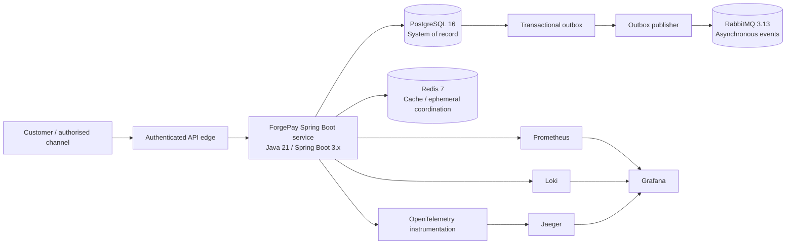
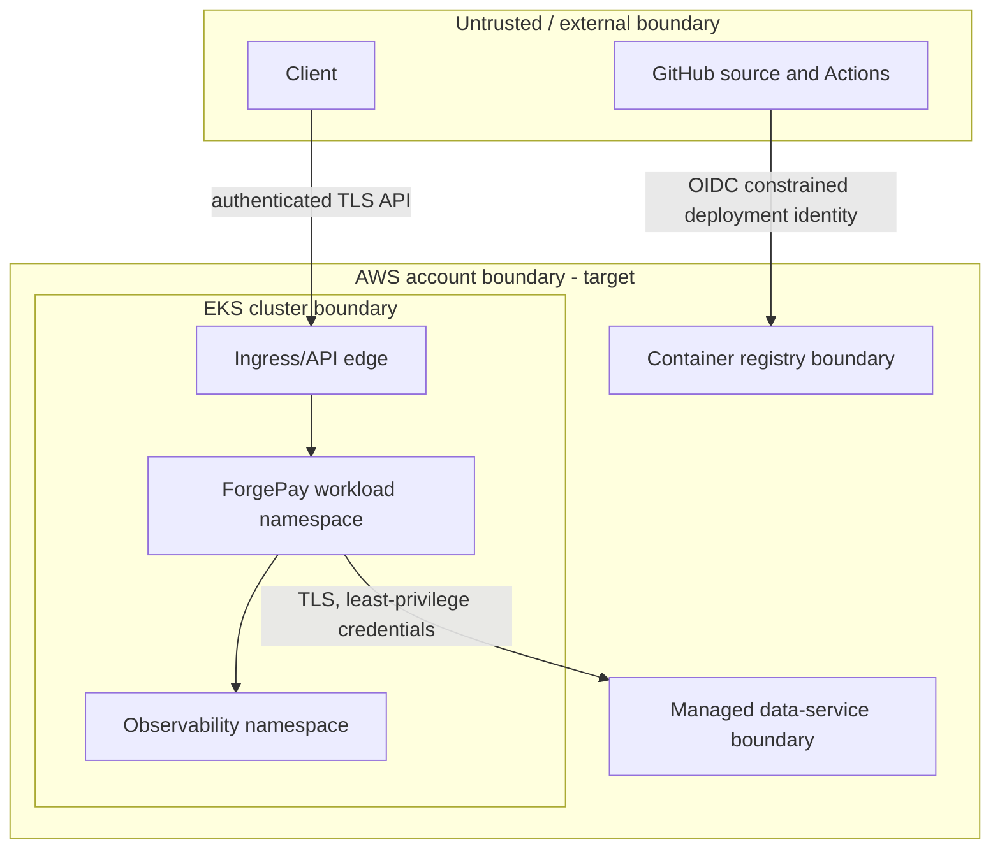

# Overall Production Architecture

## AI Attribution Block

AI-assisted architecture draft; requires human review before implementation. This is a target design and contains no claim of deployed infrastructure, measured availability, or compliance certification.

## Target system context

ForgePay is targeted as a Java 21 / Spring Boot 3.x digital-bank platform running on Kubernetes in AWS EKS. The initial deployment unit is a **modular Spring Boot service**, not an unbounded set of microservices. This keeps a modular platform implementation coherent while preserving explicit module boundaries that can be extracted when team ownership, scaling, or release independence justifies the cost.

## Application and service boundaries

The target service uses ports-and-adapters with inward dependencies. Controllers, persistence, messaging, and telemetry adapters depend on application use cases; domain policy does not depend on Spring, PostgreSQL, RabbitMQ, or Kubernetes APIs.

| Module / bounded context | Responsibility | Consistency and integration boundary |
| --- | --- | --- |
| Customer & Access | Customer-facing identity references, access-session hand-off, authorization input | Owns no credential store in this baseline; integrates with an approved identity provider through an adapter |
| Accounts & Ledger | Account state and monetary posting invariants | PostgreSQL transaction is authoritative; external side effects use an outbox pattern |
| Payments | Payment initiation, state transitions, idempotency and orchestration | Commands are synchronous at the API boundary; downstream work is event-driven where consistency permits |
| Notifications | Delivery requests and notification status | Consumes versioned events; cannot alter ledger truth |
| Operations & Audit | Operational query models and immutable audit-event interfaces | Read-oriented; no direct write path into ledger aggregates |

No external payment rail, customer identity provider, or notification supplier is selected in this phase. Each remains behind a port and anti-corruption adapter so external models cannot leak into core banking rules.

## Dependency and trust boundaries

Trust crossings require authentication, authorization, encryption in transit, auditable identity, and minimized data exposure. Precise AWS service selection, network CIDRs, encryption keys, and IAM policy statements are deferred to the IAM and Terraform phases.

## Quality attributes and trade-offs

The service is stateless and horizontally scalable at the application tier. PostgreSQL preserves transactional correctness for monetary state; RabbitMQ improves decoupling for non-atomic downstream actions but adds delivery semantics and operational burden. Redis is explicitly non-authoritative: loss or eviction must not change ledger correctness. Five-nines is a design availability SLO target, not a current reliability claim; it requires quantified dependencies, multi-AZ design, recovery objectives, capacity planning, and operational proof beyond this architecture baseline.
