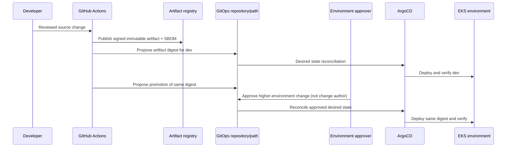

# CI/CD and Environment Promotion Architecture

## AI Attribution Block

AI-assisted architecture draft; all gates, tool connections, timings, and promotions described here are target behavior and are not yet implemented or executed.

## Canonical pipeline

GitHub Actions is the CI control plane. The target pipeline preserves a signed, immutable artifact from build through promotion; it does not rebuild per environment. ArgoCD is the CD control plane and deploys only the reviewed GitOps desired state to EKS.

```mermaid
flowchart LR
  Commit[1. Source control\nPR, protected review] --> Build[2. Build\nJava 21, JUnit, image]
  Build --> SAST[3. SAST\nSonarQube/SonarCloud]
  SAST --> Scan[4. Dependency/container scanning\nTrivy, Syft SBOM, Cosign]
  Scan --> Test[5. Integration/contract testing\nPostgreSQL, Redis, RabbitMQ, Pact]
  Test --> DAST[6. DAST\nOWASP ZAP controlled target]
  DAST --> Gate[7. Policy/compliance gates\nOPA/Conftest, Kyverno, Checkov]
  Gate --> Registry[Signed immutable image + SBOM\nartifact registry]
  Registry --> GitOps[GitOps manifest version update\nreview and approval]
  GitOps --> Argo[8. Deployment with verification\nArgoCD to EKS]
```

Each numbered item is a mandatory stage. A stage may contain multiple tools, but cannot be omitted by folding it into a preceding stage. Exact gate criteria, Actions syntax, credentials, and report retention are intentionally deferred to the DevOps and IAM phases.

## Promotion and segregation of duties

The target approval model separates source authorship, artifact publication, and higher-environment promotion. It is a design constraint, not a declaration of configured GitHub protections. Promotion target is commit-to-production under two hours, subject to approved service-level gate budgets and no manual workaround of mandatory checks.

## Artifact integrity

The image digest, SBOM identity, source revision, test evidence references, and signature are intended to travel together as release metadata. Environment manifests reference an immutable digest rather than a mutable tag. Cosign verification is designed as both a pre-deployment gate and an admission-time control; exact keyless/KMS mode is unresolved.
