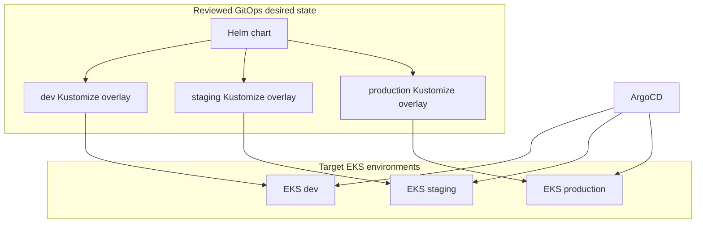
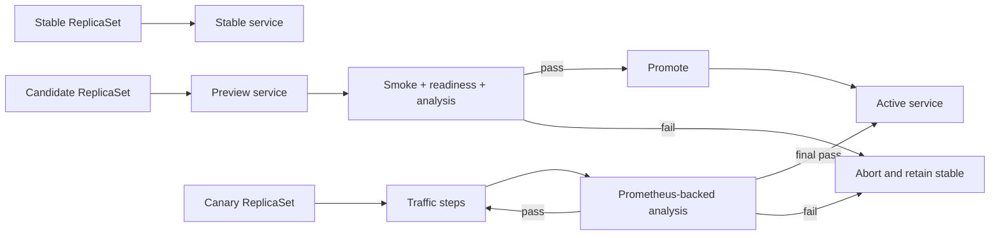

# EKS Delivery, Resilience, and Rollback Architecture

## AI Attribution Block

AI-assisted target design only. No EKS clusters, ArgoCD applications, Helm charts, Kustomize overlays, rollouts, or rollback events exist or are evidenced by this document.

## Target environment topology

Dev, staging, and production are isolated environment boundaries. The preferred target is separate AWS accounts and EKS clusters for production versus non-production; at minimum, production must be isolated by account/cluster and access boundary. Helm provides shared workload packaging; Kustomize overlays make explicit environment differences such as image digest, replica count, ingress hostname, and rollout analysis references.

## Progressive delivery

Argo Rollouts (or an equivalently supported ArgoCD-integrated rollout controller, selected during implementation) is the target orchestrator for both patterns:

| Pattern | Intended use | Verification | Reversal |
| --- | --- | --- | --- |
| Blue-green | High-confidence release with a ready standby version; database-compatible releases | Pre-promotion smoke/health checks and approved analysis | Switch traffic back to stable service selector |
| Canary | Incremental exposure for changes with measurable user-facing risk | Stepwise traffic, error/latency/saturation analysis and explicit pause gates | Abort rollout, shift traffic to stable revision |

Automated rollback triggers are architectural requirements, not defined thresholds: availability, error rate, latency, saturation, failed readiness, failed synthetic checks, and rollout-analysis failures are candidate triggers. Their specific thresholds, windows, and ownership must be agreed by SRE before implementation to avoid unsafe or oscillating rollbacks.

## Rollback decision architecture

Application rollback restores a previously verified image digest and GitOps revision. Database rollback is deliberately separate: with expand-contract delivery, the old and new application versions must remain schema-compatible through the rollout and rollback window. A failed destructive migration is not automatically reversible; it requires a documented forward-fix or restore decision in a later database reliability phase.
