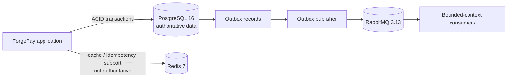
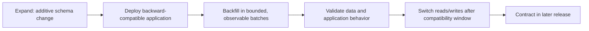
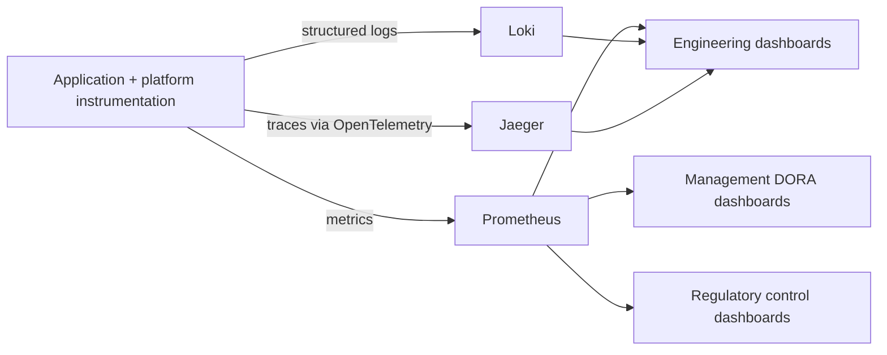

# Data, Security, Compliance, and Observability Architecture

## AI Attribution Block

AI-assisted architecture draft. It establishes target boundaries and control intent, not implemented security controls, regulatory compliance, collected logs, traces, dashboards, or operational metrics.

## Data placement and asynchronous consistency

PostgreSQL is the source of truth for monetary and other transactionally consistent data. Redis may accelerate reads and support ephemeral coordination but cannot become the financial record. RabbitMQ events are at-least-once by default in this design; consumers must be idempotent and event contracts versioned. The outbox approach prevents a database commit succeeding while publication is silently lost.

## Zero-downtime expand-contract migrations

Contract changes are delayed until the previous application revision can no longer be rolled back. Migrations must be bounded, resumable, and designed to avoid long locks. This phase does not select a migration framework or define a backup/restore procedure.

## Security and compliance control boundaries

| Boundary | Target control intent | RBI / PCI-DSS v4.0 relevance |
| --- | --- | --- |
| Source to CI | Protected review, traceable changes, non-human workload identity | Change governance, secure development evidence |
| CI to registry | Signed immutable images, SBOM, scan and provenance references | Software integrity and vulnerability-management traceability |
| Registry to EKS | Digest pinning and signature/admission verification | Authorized software execution |
| Workload to data | Least privilege, encrypted transport, secret minimization, auditability | Access control, cryptographic protection, logging expectations |
| Operational access | Segregated duties, approval and audit trail | Privileged-access and change-control accountability |
| Telemetry | Redaction/minimization and access controls | Preventing sensitive/payment data exposure in logs and traces |

This mapping is a design traceability aid, not an RBI determination or PCI-DSS compliance attestation. Cardholder-data scope, data classification, retention, key management, and control ownership require formal security/compliance decisions.

## Observability architecture

Telemetry is designed around correlation IDs, release identifiers, and redaction. Target dashboards are Engineering, Management, and Regulatory. The platform specification requires DORA metrics and at least 15 pipeline/operational metrics; this architecture reserves the collection paths but does not claim that metrics are populated. SLOs—including the five-nines availability target—must be specified with calculation windows, dependency exclusions, and error budgets in the SRE phase.
