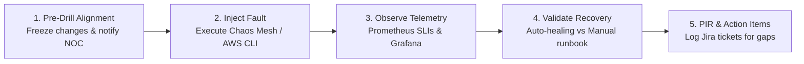

# ForgePay SRE GameDay Scenarios & Chaos Execution Playbook

## AI Attribution Block
AI-assisted SRE playbook detailing scenario preparation, inject timelines, and blameless evaluation protocols.

---

## 1. Scenario Execution Flow

---

## 2. Observer & Scribe Checklist
- [ ] Record exact UTC timestamp of fault injection.
- [ ] Record time-to-detection (TTD) from Prometheus alert firing.
- [ ] Verify multi-burn-rate alert routing to PagerDuty.
- [ ] Confirm whether automated rollback triggered within 5-minute analysis window.
- [ ] Audit application logs to confirm zero unredacted PAN/CVV occurrences during panic dumps.
